# Crop Crafter – Smart Agriculture Robot

## Overview
Crop Crafter is a smart agriculture robot designed to automate irrigation, crop monitoring, object detection, and basic harvesting tasks. The system integrates IoT sensors, an ESP32-CAM based machine learning model, a robotic arm, and a mobile application for real-time monitoring and control.

## System Architecture
The robot uses ESP8266 and ESP32-CAM modules for communication, sensor data acquisition, and image-based object detection. Wireless communication is established using ESP-NOW and HTTP protocols.

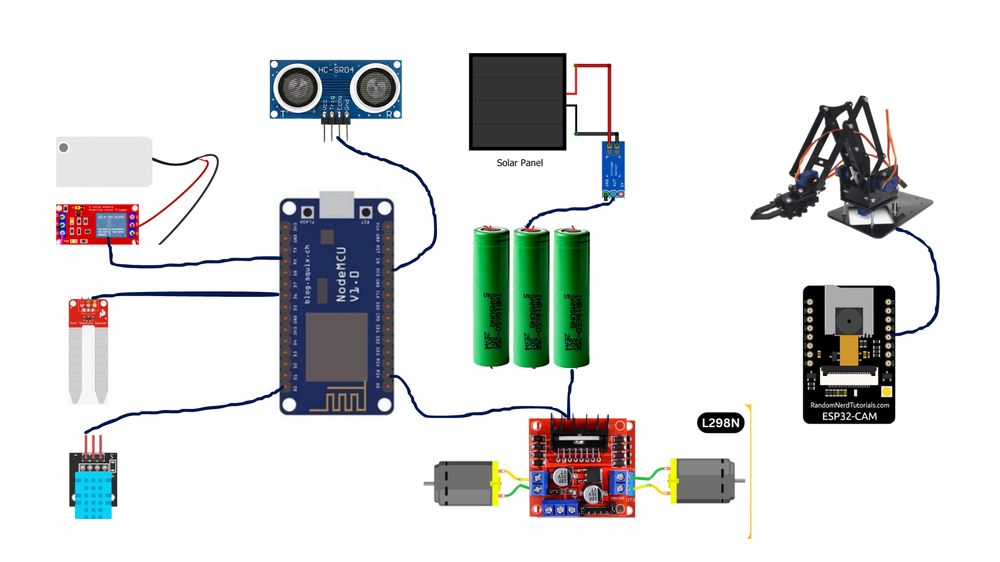

## Hardware Components
- ESP8266 (NodeMCU)
- ESP32-CAM
- Ultrasonic Sensor
- Soil Moisture Sensor
- DHT11 Temperature & Humidity Sensor
- L298N Motor Driver
- DC Motors
- 4-DOF Robotic Arm
- Solar Panel and Rechargeable Batteries
- Water Pump

## Algorithm Workflow
The system follows a structured workflow:
1. Initialize hardware components
2. Collect environmental sensor data
3. Capture images using ESP32-CAM
4. Perform ML-based object detection
5. Execute irrigation, obstacle avoidance, or robotic arm tasks
6. Report status via mobile application

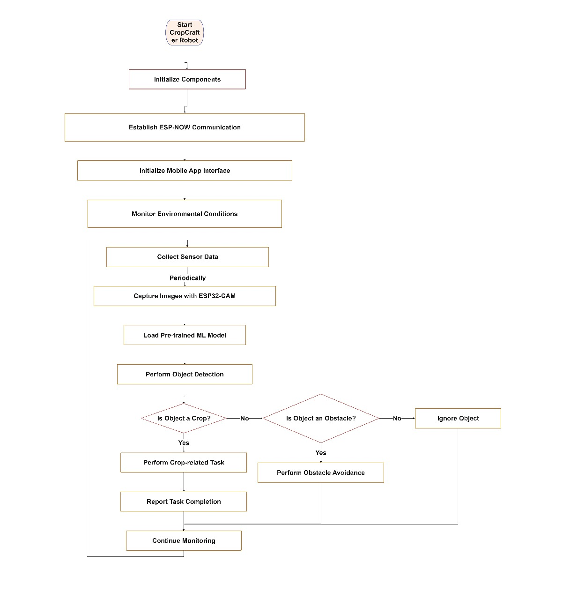

## Machine Learning Integration
Object detection is implemented using Edge Impulse with a MobileNetV2 FOMO model deployed on ESP32-CAM. The model identifies crops and objects and provides location coordinates for robotic arm control.

## Mobile Application
An Android application developed using MIT App Inventor allows:
- Real-time sensor monitoring
- Manual irrigation control
- Robotic arm movement via sliders
- Display of detected object names and coordinates

### App Screens
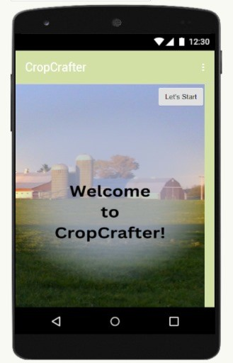
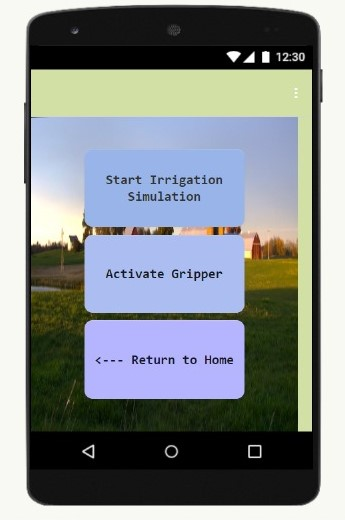
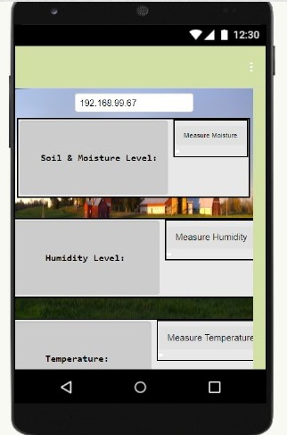
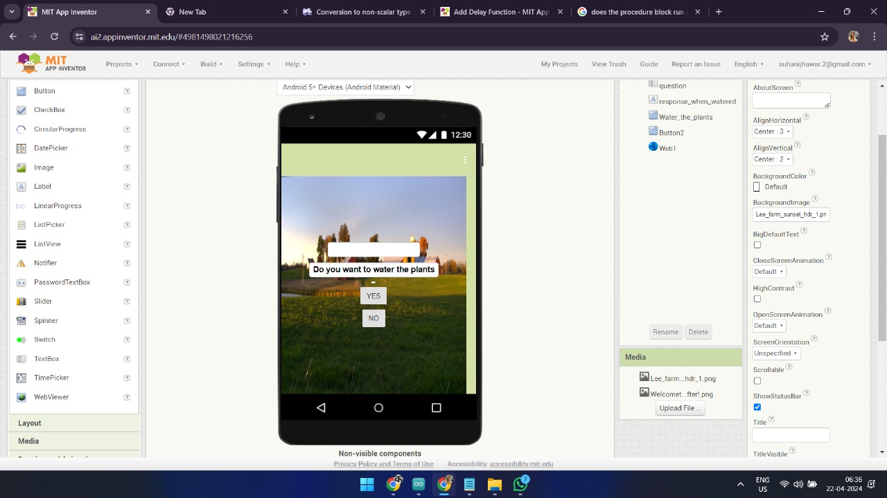
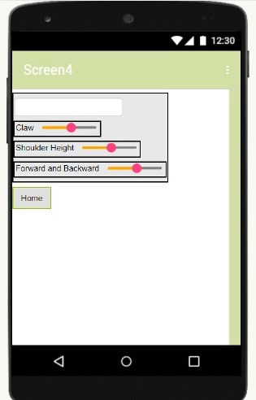
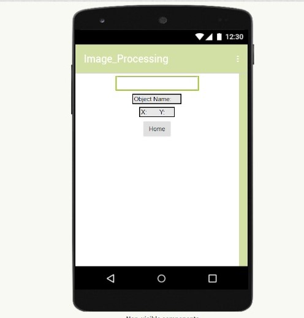

## Physical Prototype
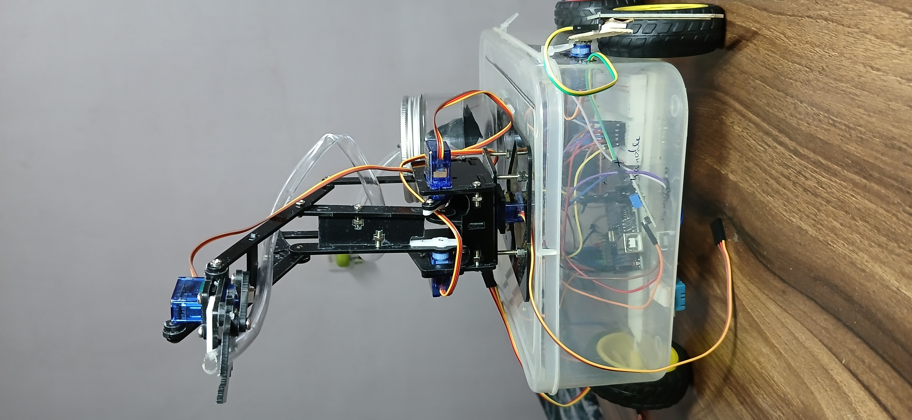
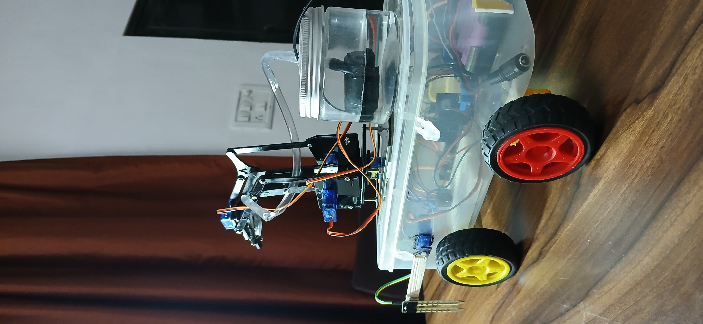
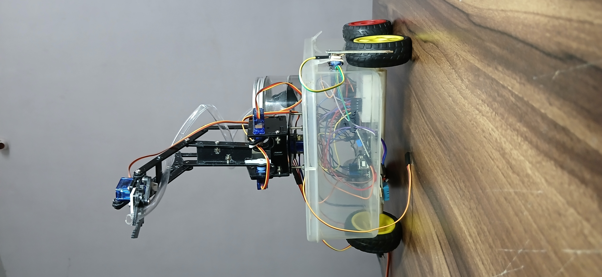

## Results
- ML model accuracy: ~82%
- Successful real-time irrigation control
- Stable wireless communication and robotic arm actuation

## Future Enhancements
- Autonomous navigation using GPS
- Cloud data logging
- Improved ML model accuracy
- Weather-based irrigation scheduling

